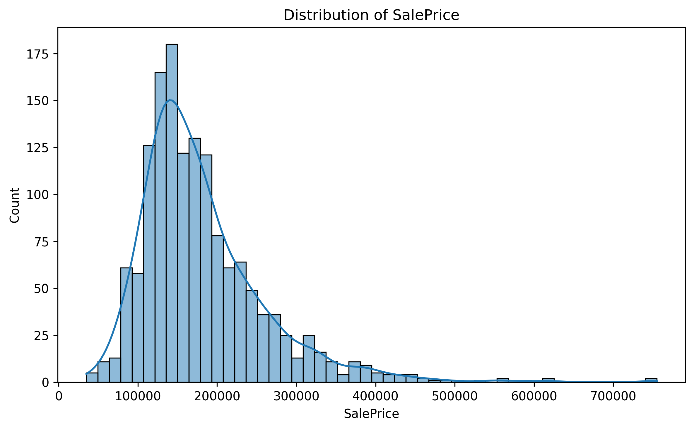
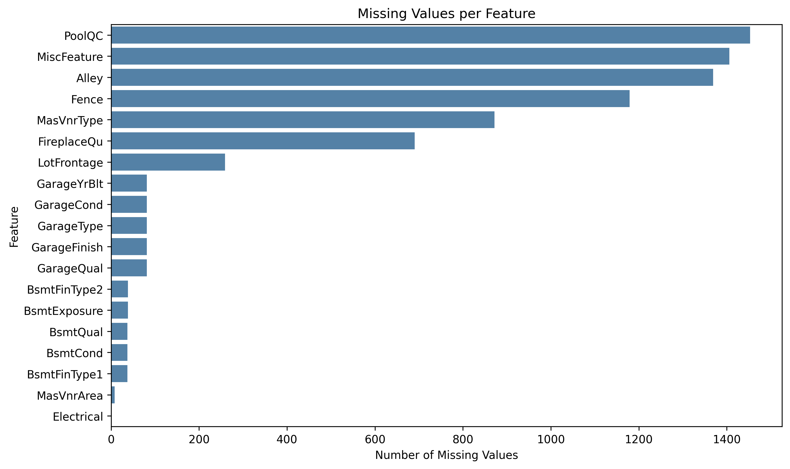
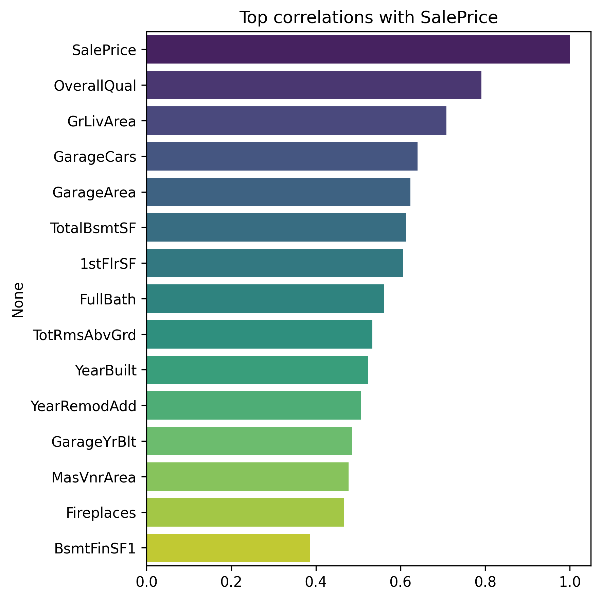
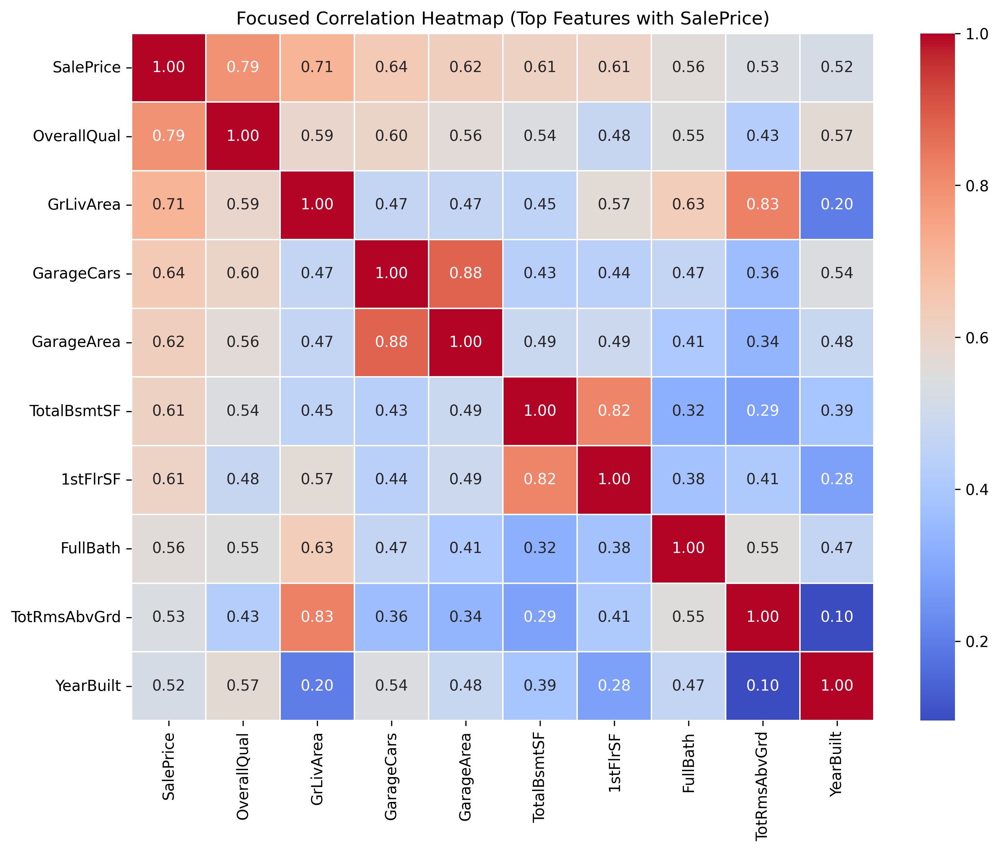
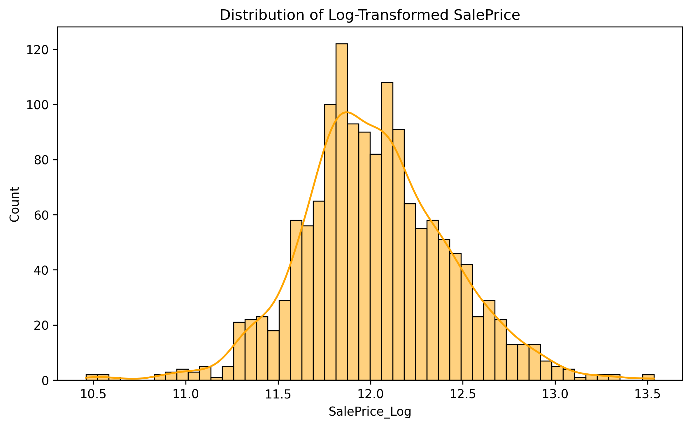
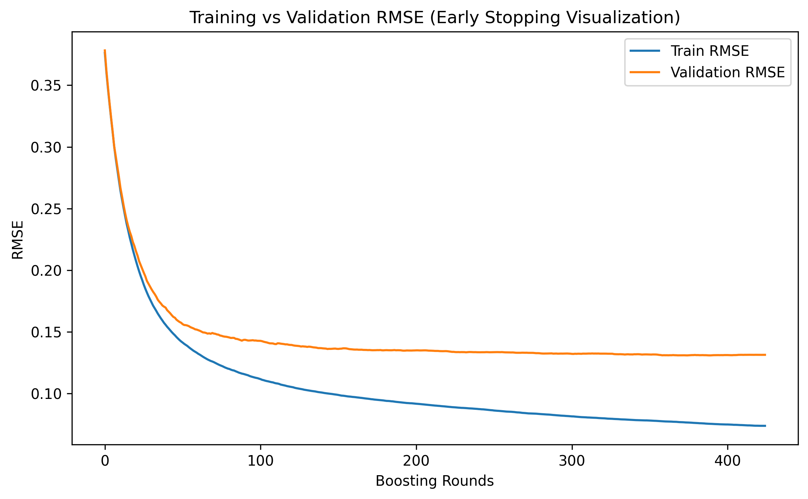

# 🏠 House Prices Prediction

Predicting house prices is a classic regression challenge.  
This project was an opportunity for me to build a complete **end-to-end regression pipeline**,  
from exploratory data analysis all the way to training a tuned model with **early stopping** for optimal performance.

---

## Dataset

The dataset used is the well-known **Kaggle House Prices - Advanced Regression Techniques** dataset (`train.csv` and `test.csv`).  
It contains a wide range of numeric and categorical features describing residential homes in Ames, Iowa.

- **Train set**: 1,460 rows × 81 columns (including `SalePrice`)  
- **Test set**: 1,459 rows × 80 columns (without `SalePrice`)  
- **Target**: `SalePrice` (the house sale price in USD)

---

## 📊 Step 1 - Exploratory Data Analysis (EDA)

The first step was to explore and understand the dataset:

- The target variable `SalePrice` is **right-skewed** (skewness ≈ 1.88).  
- Some columns contain **many missing values**, especially `PoolQC`, `Alley`, `Fence`, and `MiscFeature`.  
- Key numerical features such as `OverallQual`, `GrLivArea`, and `GarageCars` show strong positive correlations with `SalePrice`.

**Target distribution**



**Missing values**



**Top correlations with SalePrice**



**Focused correlation heatmap (top features)**



---

## ⚙️ Step 2 - Preprocessing

The preprocessing workflow included several important steps:

- Dropped columns with **excessive missingness** (`PoolQC`, `MiscFeature`, `Alley`, `Fence`).  
- Applied **median imputation** for numerical features and **most frequent imputation** for categorical ones.  
- Encoded categorical variables using **One-Hot Encoding**.  
- Scaled numerical features with **StandardScaler**.  
- Built a single **ColumnTransformer** to unify preprocessing and prevent data leakage.  
- Applied a **log transformation** on the target (`np.log1p(SalePrice)`) to normalize it.

**Original vs log-transformed target**



After preprocessing, the dataset expanded from **75 to 274 columns** due to one-hot encoding.

---

## 🤖 Step 3 - Models and Training

I compared several regression models to find the best performing one.

### 1️⃣ Linear Regression (Baseline)

A simple baseline model trained on the preprocessed data.  
Despite its simplicity, it achieved strong performance due to the linear nature of many features.

---

### 2️⃣ Random Forest

- Tested both baseline and **RandomizedSearchCV** versions.  
- Tuned hyperparameters such as `n_estimators`, `max_depth`, and `min_samples_split`.  
- Results showed slightly lower accuracy than Linear Regression, indicating potential overfitting and limited benefit for this dataset.

---

### 3️⃣ XGBoost (Final Model)

The **XGBoost Regressor** was the final and best-performing model.  
It was optimized in two stages:

1. **RandomizedSearchCV** for broad exploration  
2. **GridSearchCV** for fine-tuning around the best parameters  

**Final optimal parameters:**
```yaml
max_depth: 2
learning_rate: 0.07
n_estimators: 600
subsample: 0.74
colsample_bytree: 0.70
gamma: 0.02
reg_alpha: 0.11
reg_lambda: 0.65
```


Training used a validation split and **early stopping**:

- `num_boost_round=1000`  
- `early_stopping_rounds=50`  
- Best iteration: **374**

**Early stopping curve (train vs validation RMSE)**



---

## ✅ Step 4 - Evaluation and Results

I evaluated all models using RMSE, MAE, MedianAE, MAPE, and R² on the test set.

| Model | RMSE | MAE | MedAE | MAPE | R² |
|---|---:|---:|---:|---:|---:|
| Linear Regression | 0.1289 | 0.0896 | 0.0602 | 0.75% | 0.9109 |
| Random Forest (Baseline) | 0.1448 | 0.0982 | 0.0665 | 0.83% | 0.8877 |
| Random Forest (Tuned) | 0.1455 | 0.0976 | 0.0640 | 0.82% | 0.8865 |
| XGBoost (Baseline) | 0.1480 | 0.0961 | 0.0642 | 0.81% | 0.8826 |
| **XGBoost (Final)** | **0.1269** | **0.0856** | **0.0605** | **0.72%** | **0.9137** |

The **final XGBoost model** achieved the lowest error and highest R², outperforming both Random Forest and Linear Regression.

---

## 🏆 Step 5 - Final Model: XGBoost with Early Stopping

The final model used **early stopping** to avoid overfitting:

- **Best iteration**: 374  
- **Best RMSE (validation)**: 0.1245  

The validation curve showed smooth convergence, with the validation RMSE stabilizing after ~370 rounds.

This confirms that early stopping helped the model generalize efficiently without unnecessary complexity.

---

## 💾 Step 6 - Using the Model

The final pipeline was exported using `joblib`:

`models/xgb_final_model.pkl`

Example of loading and using the model:

```python
import joblib
import pandas as pd
import numpy as np

# Load the trained pipeline
model = joblib.load("models/xgb_final_model.pkl")

# Example new house data
X_new = pd.DataFrame([...])  # must have the same columns as training

# Predict log-sale prices
y_log_pred = model.predict(X_new)

# Convert back to original scale
y_pred = np.expm1(y_log_pred)
```

---

## 📝 Conclusion

This project demonstrated how to handle a **complex regression dataset** through a complete ML workflow:

1. In-depth exploratory data analysis  
2. Feature preprocessing with pipelines  
3. Comparison of multiple models  
4. Hyperparameter tuning  
5. Early stopping for regularization  

The final **XGBoost model** achieved an **RMSE of 0.1269** and **R² of 0.9137**,  
successfully capturing non-linear patterns while maintaining strong generalization.

By combining good preprocessing, thoughtful model tuning, and early stopping,  
the project achieved a **robust and interpretable solution** for **house price prediction**.
